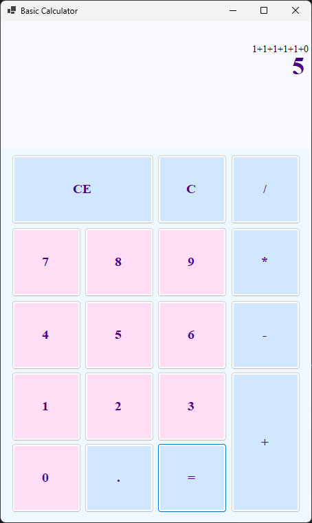
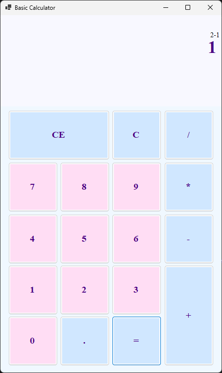
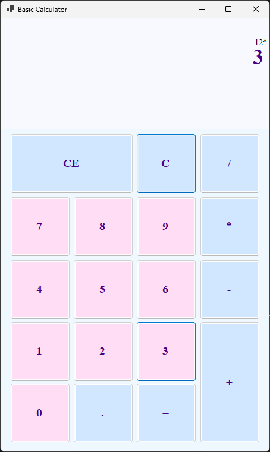
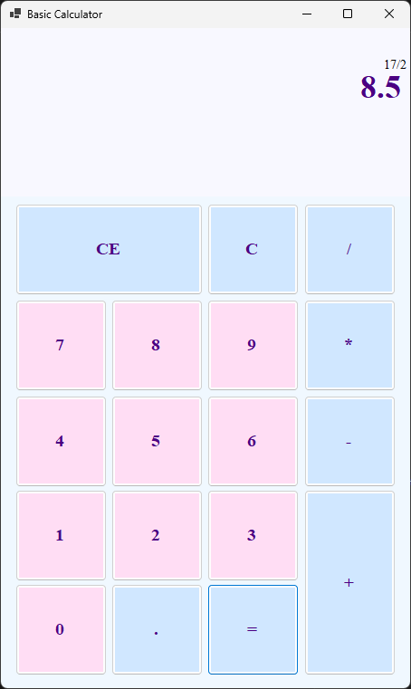

#  Pastel Calculator

## Description
This is a Windows 11 inspired standard calculator
with a pastel color twist.
The program is made using WinForms C#.
The calculator provides an intuitive and clean design.

The calculator features basic arithmetic operations such 
addition, subraction, multiplication, and division.
### File Structure
```
project
| -- Win11Calculator
|    | -- Form1.cs
|    | -- Form1.designer.cs
|    | -- Form1.resx
| -- archives
|    | -- Win11Calculator_addition.png
|    | -- Win11Calculator_subtraction.png
|    | -- Win11Calculator_multiplication.png
|    | -- Win11Calculator_division.png
```
### Pre-requisites
- .NET SDK version 8 and above

First build the application using the SDK using this command
```shell
dotnet build -p Win11Calulator/Win11Calulator.csproj
```
Then run the application using this command
```shell
dotnet run -p Win11Calculator/Win11Calculator.csproj
```

The application will provide a clean user interface to use.

## Screenshots
These are some screenshots taken using the program.

**Addition**



**Subtraction**



**Multiply**



**Division**

